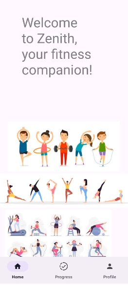

# Zenith Fitness Tracking Application

## Introduction
Zenith is  a mobile application designed to help users monitor their physical activities and providing statistics and suggestions on workouts.

This is the application as seen from appetize io - https://appetize.io/app/b_hxx4pje3wkgc43pmfu4uswcssq

## Author
Clency Christine

## Medium Blog
https://medium.com/@clency2023/alx-portfolio-project-final-foundations-project-0e884307220b

## Installation
The build apk is available for installation on your android device, as we wait for approval to playstore

[Download The Debug apk] -- /home/clencyc/AndroidStudioProjects/ZenithBackup/app/build/outputs/apk/debug

## Usage
1. Download the apk from the specified path
2. Transfer the apk to your android device
3. Open the APK on your device and follow the prompts to install. You may need to enable installation from unknown sources in your device settings.
4. Sign Up: Create an account after entering your credentials.
5. Enjoy the experience around the application.
   

## Upcoming features
I would like to integrate AI in recommending the workouts and also build a community for the application to help keep track of the progress.

## Contributing
Contributions are welcome. You can contribute by forking the repository and making a pull request. You can also open an issue if you find any bugs or have any feature requests.

Thank you :D
